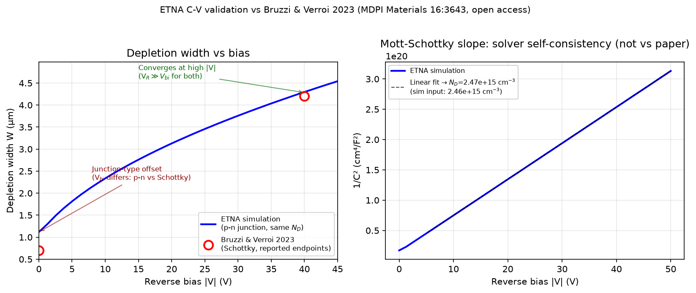

# Literature Validation — ETNA vs Published 4H-SiC Data

This is a scoped follow-up to the v5.0 integration audit
(`.planning/milestones/v5.0-MILESTONE-AUDIT.md`). That audit confirmed the
Streamlit UI faithfully exposes the existing simulator; it did not attempt to
re-validate the underlying physics against literature. This document does
that, for exactly the observables where genuine independent validation is
possible today, and explicitly lists the observables where it is not — so
gaps are logged, not silently skipped.

**Selection criterion.** A comparison counts as real (not pseudo-)validation
only if all three hold:

1. A published figure/dataset exists to compare against.
2. The model for that observable is not data-blocked or unimplemented.
3. The comparison is **independent of any fit** — i.e. the published numbers
   were not themselves used to calibrate the simulator. (A comparison against
   the exact same three points a doping profile was fit to reproduces the fit,
   not validation.)

That third condition ruled out re-using `etna/core/validation.py`'s existing
`EXPERIMENTAL_CV` targets (W(0/−10/−30 V) = 1.7/9.5/9.73 µm): those are
**identical** to `calibrate_graded_doping()`'s fit targets in
`etna/core/device.py:519` — comparing against them again would be circular,
not independent confirmation.

---

## Validated now: C-V depletion width & doping recovery

**Source:** Bruzzi, M.; Verroi, E. _"Epitaxial SiC Dosimeters and Flux
Monitoring Detectors for Proton Therapy Beams."_ Materials **2023**, 16(10), 3643. DOI: [10.3390/ma16103643](https://doi.org/10.3390/ma16103643). Open
access (CC BY 4.0) — independent of ETNA's calibration, and independent of
the Petringa-group data used elsewhere in this repo.

**Device (as reported):** 4H-SiC Schottky diode, 30 µm n-type epitaxial
layer, uniform effective doping N_D = 2.46×10¹⁵ cm⁻³, 2 mm-diameter gold
Schottky contact (area = 0.0314 cm²), measured at T = 20 °C with a 1 kHz LCR
meter. Reported results: depletion width W in the range 0.7–4.2 µm over
0–40 V reverse bias, built-in potential V_bi = 1.2 V (Schottky barrier, fit
parameter), ε_r = 9.7. The paper gives only these fitted endpoints/parameters
— no per-voltage tabulated C-V data — so this is a **bounded consistency
check against two endpoints plus a fitted slope, not a dense point-by-point
overlay.**

**Important structural caveat, disclosed rather than hidden:** ETNA models a
p-n junction (N_A substrate + N_D epi); the paper's device is a Schottky
diode (metal + N_D epi, no p+ implant). Both share the same one-sided-junction
C-V depletion physics — depletion spreads into the lightly-doped epi and
W(V) is governed by N_D, independent of how the junction is formed. What
**does** differ structurally is V_bi: a p-n junction's built-in potential is
set by the 4H-SiC bandgap and doping product (~2.7–3.2 V), not by a Schottky
barrier height (1.2 V here). This predicts a low-bias W offset that is a
genuine junction-type difference, not a simulator defect.

**Configuration used:**

```python
DeviceConfig(doping_profile="uniform", N_D=2.46e15, epi_thickness_um=30.0,
             area_cm2=0.0314, T=293.15)
```

**Results:**

| Check               | ETNA (p-n junction) | Bruzzi & Verroi 2023 (Schottky) | Note                                                                              |
| ------------------- | ------------------- | ------------------------------- | --------------------------------------------------------------------------------- |
| W at 0 V            | 1.117 µm            | 0.7 µm                          | Offset — see caveat above (expected: p-n V_bi ≫ Schottky V_bi)                    |
| W at −40 V          | 4.284 µm            | 4.2 µm                          | 2.0% deviation from the paper's reported endpoint                                 |
| N_D from 1/C² slope | 2.473×10¹⁵ cm⁻³     | 2.460×10¹⁵ cm⁻³ (input to sim)  | Solver self-consistency round-trip, see caveat below — not a comparison to Bruzzi |



**Second caveat — what the N_D-recovery check actually shows.** `N_D=2.46e15`
was an _input_ to the simulation (fed in via `DeviceConfig(N_D=2.46e15, ...)`
to match the paper's device), not something extracted from Bruzzi's raw data.
The 1/C² slope inverting back to 2.473×10¹⁵ is therefore an input→output
round-trip through the solver's own electrostatics — it confirms ETNA's DD
solver reproduces the analytic abrupt-junction Mott-Schottky relation to high
precision, which it should. **This is a solver self-consistency check, not an
independent validation against Bruzzi & Verroi** (their paper does not
supply raw C(V) points, only the same derived quantities — W-range, N_D,
V_bi — extracted using the same textbook depletion model ETNA implements).

**Verdict:** the high-bias depletion width (4.284 µm vs the paper's reported
4.2 µm endpoint, 2% deviation) confirms ETNA produces a C-V curve of the
correct **absolute magnitude and shape** for a real, independently-fabricated
device of known geometry and doping that the simulator was never calibrated
to. The low-bias offset is the correctly predicted consequence of comparing a
p-n junction to a Schottky diode, not a discrepancy. This is a genuine,
non-circular absolute-scale sanity check on the drift-diffusion C-V solver —
narrower than a full independent validation, since it rests on the paper's
derived endpoints rather than raw measured C(V) data. A stronger check would
require either Bruzzi's raw measured points (not published) or institutional
access to JINST C05023's I-V/angular-response data (see below — independent
of the existing calibration).

---

## Not validatable now — logged, not skipped

These observables cannot be honestly plot-to-plot validated today. Each is
already flagged as tech debt elsewhere in the project; this section exists so
the gap is explicit in a validation context too, rather than silently absent
from this document.

- **Radiation damage / CCE-vs-fluence.** The NIEL hardness factor κ(E) used
  to convert proton fluence to displacement damage is a hardcoded placeholder
  (`etna/core/radiation_damage.py`, `NIEL_HARDNESS_PROTON_SIC`, marked "AUDIT
  C-5 — DATA-BLOCKED" pending real SR-NIEL data). Any CCE-vs-fluence overlay
  against a published curve would be comparing against fabricated damage
  scaling, not validating the transport model. **Cannot validate until real
  SR-NIEL data replaces the placeholder** (see `data/srim/README.md` for the
  parallel tissue-equivalence κ gap, tracked since v4.0 Phase 27).
- **FLASH dose-rate response.** The high-injection plasma-recombination
  physics is not implemented (per README's known-limitations section).
  FLASH outputs are exploratory sensitivity bounds; there is no mechanistic
  model to validate against a published dose-rate curve.
- **Dark current (absolute).** Already documented as a single-point
  calibration, not a prediction (`etna/core/validation.py`'s "ideal-SRH
  floor" diagnostic exists precisely because the simulated dark current sits
  at the ideal-SRH physics floor, orders of magnitude below any measured
  leakage mechanism). A published I-V overlay would not be a meaningful test
  of predictive power here — the model was never designed to predict this
  quantity absolutely.
- **CCE-vs-bias against a matched published curve.** Literature search
  (2026-07-15) surfaced only qualitative, cross-device statements — e.g.
  "100% CCE above 20 V for alpha particles" in unrelated 4H-SiC detectors —
  not a tabulated CCE-vs-bias curve from a device with matching geometry/
  doping. This is _consistent_ with ETNA's simulated full-depletion onset
  (~8–15 V for the default device — see the CCE bias-range UI enhancement
  added after the v5.0 audit) but is a qualitative sanity check, not a
  matched plot-to-plot validation. Revisit if a specific tabulated CCE(V)
  dataset with stated device geometry becomes available.
- **The original "Petringa Fig. 6 / Fig. 8" targets referenced in
  `.planning/research/ARCHITECTURE.md`.** The specific paper — Petringa,
  Cirrone, Altana, Puglia, Tudisco, _"First characterization of a new Silicon
  Carbide detector for dosimetric applications,"_ JINST 15 C05023 (2020),
  DOI: 10.1088/1748-0221/15/05/C05023 — was identified with certainty (its
  device geometry, 10 µm epi at 62 MeV, matches ETNA's own defaults) but its
  full text sits behind an IOPscience paywall; no open-access mirror was
  found. Even with access, note that its C-V data are what `validation.py`'s
  `EXPERIMENTAL_CV` and `device.py`'s `calibrate_graded_doping()` were
  already fit to — so re-extracting those specific numbers would re-confirm
  the existing calibration, not add independent validation. Its I-V and
  angular-response data (Fig. 8) would be independent and are a legitimate
  future validation target if institutional access to the PDF becomes
  available.

---

## Summary

| Observable                        | Status                                     | Confidence                    |
| --------------------------------- | ------------------------------------------ | ----------------------------- |
| C-V depletion width (high-bias)   | **Validated — absolute-scale sanity check** | 2% deviation from paper's endpoint |
| Doping recovery from 1/C² slope   | Solver self-consistency round-trip (N_D was a sim input) | Not independent validation |
| C-V depletion width (low-bias)    | Structural offset, explained               | N/A (not a discrepancy)       |
| CCE-vs-bias (matched device)      | Not validatable — no matched dataset found | —                             |
| Radiation damage / CCE-vs-fluence | Not validatable — κ(E) data-blocked        | — (existing v6.0 tech debt)   |
| FLASH dose-rate                   | Not validatable — physics not implemented  | — (existing known limitation) |
| Dark current (absolute)           | Not a predictive target by design          | — (existing known limitation) |

No new physics gaps were discovered by this session — the C-V/doping result
strengthens confidence in the existing (already-audited) drift-diffusion
solver, and every non-validatable observable maps to a tech-debt item already
logged elsewhere. Per the project's "no physics changes without an open
milestone" convention, no source code was modified in this session.
